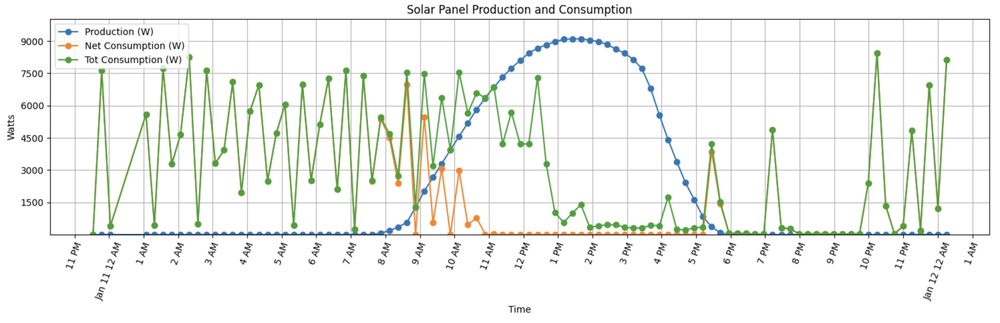

# Enphase Python Graph

Queries local Enphase IQ Gateway API data to build out metrics for graph data

## Description

The Enphase App (and site) rely on data uploaded from your local Enphase IQ Gateway into the cloud. I often notice significant delays in reporting within the app resulting directly from this data not being uploaded. I wanted a way to report on live data direct from my system w/o having the extra dependencies of live internet connection or enphase application service outages.



### Dependencies

-   Python3
-   Local Enphase IQ Gateway
-   pyenv (optional, for managing Python versions and virtual environments)

### Setup

1. **Install pyenv and pyenv-virtualenv** (if not already installed):
   Follow the instructions from the [pyenv](https://github.com/pyenv/pyenv#installation) and [pyenv-virtualenv](https://github.com/pyenv/pyenv-virtualenv#installation) repositories to install these tools.

2. **Clone the repository**:
    ```sh
    git clone https://github.com/yourusername/pyEnphaseGraph.git
    cd pyEnphaseGraph
    ```
3. **Set up the virtual environment**:
    ```sh
    pyenv install 3.10.0  # Install Python 3.10.0 if not already installed
    pyenv virtualenv 3.10.0 pyEnChart  # Create a virtual environment named 'pyEnChart'
    pyenv activate pyEnChart  # Activate the virtual environment
    ```
4. **Install the dependencies**:
    ```sh
    pip install -r requirements.txt  # Install the required packages
    ```
5. **Create a .env file with the necessary environment variables**:  
    E.G.  
   ENPHASE_IQ_GATEWAY_IP=http://your-enphase-iq-gateway-ip
6. **Run the script:**
    ```
    python queryEnphaseGateway.py
    ```
7. **OR set up as a service**:

    1. **Create the service file (and mod as needed)**:

        ```sh
        sudo cp pyEnphaseGraph.service /etc/systemd/system/
        ```

    2. **Reload the systemd daemon to recognize the new service**:

        ```sh
        sudo systemctl daemon-reload
        ```

    3. **Enable the service to start on boot**:

        ```sh
        sudo systemctl enable pyEnphaseGraph.service
        ```

    4. **Start the service**:

        ```sh
        sudo systemctl start pyEnphaseGraph.service
        ```

    5. **Check the status of the service**:
        ```sh
        sudo systemctl status pyEnphaseGraph.service
        ```

Inspiration, code snippets, etc.

-   [Enphase local IQ Gateway API Documentation](https://enphase.com/download/accessing-iq-gateway-local-apis-or-local-ui-token-based-authentication?srsltid=AfmBOoomOm3FlVi2W7OwHoV-aJ-OdVSL5kJrt5HmSgAqJBBv4qaDluRW)
-   [Enphase IVP PDM Route troubleshooting](https://support.enphase.com/s/question/0D53m00009Ph9G0CAJ/why-am-i-still-unable-to-pull-daily-weekly-and-lifetime-production-data-from-local-api-with-homeowner-token)
